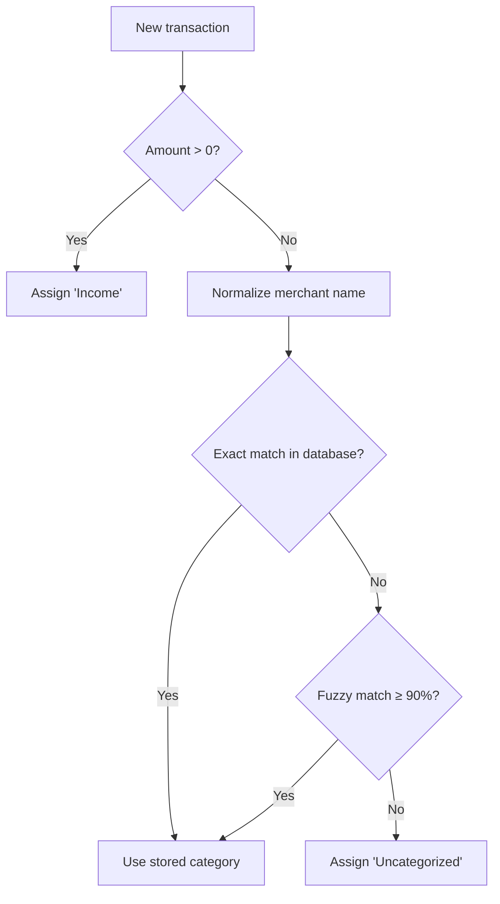

# Categorization

Spendwise automatically categorizes transactions by recognizing merchant names. This page explains how the system works and how you can teach it new categories.

## How It Works

When a transaction is imported or added, Spendwise assigns a category through the following steps:

### Step 1: Income Detection

If the transaction amount is positive, it is automatically categorized as **Income** regardless of the merchant name.

### Step 2: Merchant Normalization

For expenses, Spendwise normalizes the raw merchant description to create a consistent lookup key. Normalization includes:

- Converting to uppercase
- Removing digits and special characters (`#`, `*`)
- Stripping common words like `PENDING`, `MOBILE`, `PURCHASE`
- Removing trailing state abbreviations (e.g., `CA`, `NY`)
- Collapsing extra whitespace

For example:

| Raw Description                     | Normalized Key     |
|-------------------------------------|--------------------|
| `PENDING STARBUCKS #1234 CA`        | `STARBUCKS`        |
| `Mobile Purchase AMAZON.COM 56789`  | `AMAZON.COM`       |
| `TRADER JOE'S #567 LOS ANGELES CA` | `TRADER JOE'S LOS ANGELES` |

### Step 3: Exact Match

The normalized key is compared against stored merchant-category mappings in the database. If an exact match is found, that category is used.

### Step 4: Fuzzy Match

If no exact match exists, Spendwise uses fuzzy string matching (powered by [rapidfuzz](https://github.com/rapidfuzz/RapidFuzz)) to find the closest known merchant. A match is accepted only if the similarity score is **90% or higher**.

This handles minor variations in how the same merchant appears across statements, such as:

- `STARBUCKS` vs `STARBUCKS COFFEE`
- `AMAZON.COM` vs `AMAZON COM`

If no match meets the 90% threshold, the transaction is labeled **Uncategorized**.

## Teaching Spendwise New Categories

You train the categorization system simply by editing transactions:

1. **Double-click** a transaction (or select it and click **Edit Transaction**)
2. Change the **Category** field to your preferred category (e.g., `Groceries`, `Dining`, `Transport`)
3. Click **Save**

When you save a category change, two things happen:

1. **The merchant mapping is saved** -- Spendwise stores the normalized merchant name with its new category
2. **Uncategorized transactions are re-evaluated** -- All existing transactions marked as "Uncategorized" are checked against the updated mappings, and any that match (exact or fuzzy) are automatically recategorized

!!! example
    You edit a Starbucks transaction and change its category from "Uncategorized" to "Coffee". Spendwise saves the mapping `STARBUCKS → Coffee`. All other uncategorized Starbucks transactions are instantly recategorized to "Coffee" as well.

## Category Suggestions

When you open the edit dialog for an uncategorized transaction, Spendwise checks if a mapping already exists for that merchant's normalized name. If a match is found, the category field is pre-filled with the suggested category -- you can accept it by clicking **Save** or type a different one.

## Tips for Effective Categorization

- **Categorize early** -- The more merchant mappings Spendwise learns, the fewer uncategorized transactions you'll see on future imports.
- **Be consistent** -- Use the same category names across merchants (e.g., always use "Dining" rather than mixing "Dining", "Restaurants", and "Eating Out").
- **Let fuzzy matching work for you** -- You don't need to categorize every slight variation of a merchant. Once you categorize `STARBUCKS`, variations like `STARBUCKS COFFEE` will match automatically.
- **Review after importing** -- After importing a new statement, scan for "Uncategorized" transactions and assign categories. Each one teaches Spendwise for future imports.
